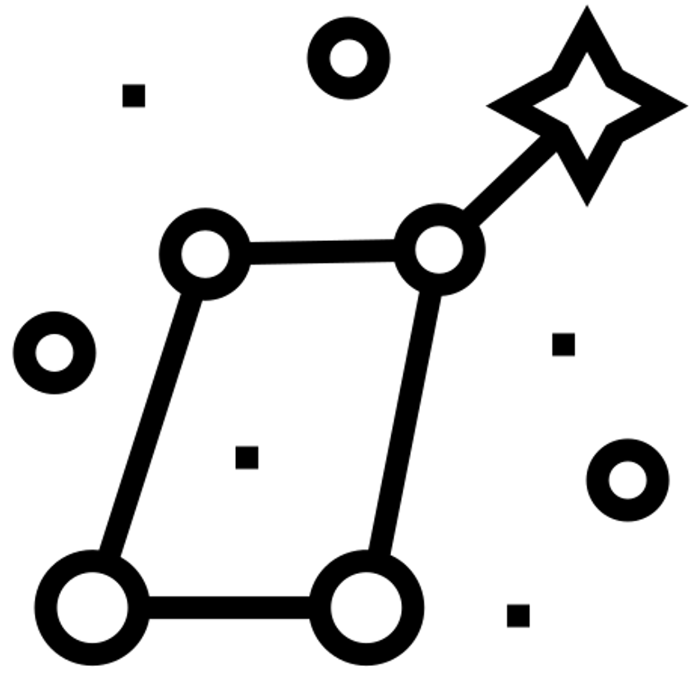
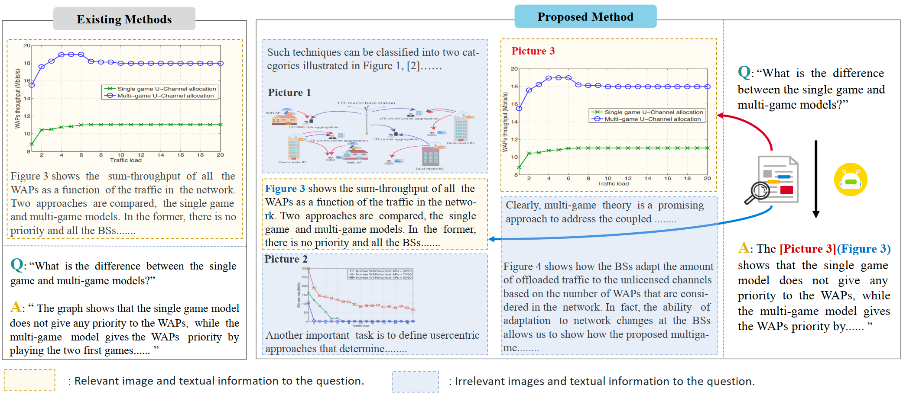

# VEGA: Learning Interleaved Image-Text Comprehension in Vision-Language Large Models

**[Project Page](https://zhourax.github.io/VEGA/)** | **[Paper](https://example.com/paper)**

We introduce a new multimodal task named Interleaved Image-Text Comprehension (IITC), designed to evaluate a model's capability to handle interleaved image-text inputs that contain redundant and misleading information. To enhance and measure model performance on the IITC task, we developed the VEGA dataset. By fine-tuning Qwen-VL-Chat on the VEGA dataset, we created VEGA-Base, a strong baseline for the IITC task.



# Dataset Structure

- Download VEGA Datasets here.
- Unzip the VEGADataset.zip and you will get the folder.

```
.
├── IITC_4k_test.json
├── IITC_8k_test.json
├── IITC_4k_train.json
├── IITC_8k_train.json
├── ITA_3picture_test.json
├── ITA_5picture_test.json
├── ITA_3picture_C_train.json
├── ITA_5picture_C_train.json
├── ITA_3picture_E_train.json
├── ITA_5picture_E_train.json
├── ITA_3picture_F_train.json
├── ITA_5picture_F_train.json
├── test_imgs
│   ├── 1001.0025v1
│   │   └── pdferror.png
│   ├── 1001.0357v1
│   │   └── Different_Capacity_regions_2dB.png
...
├── train_imgs
│   ├── 1001.0026v1
│   │   ├── bound1.png
│   │   ├── del3.png
...
```

The data in IITC*.json follows the following format:

```json
{"id": "The paper's ID on arXiv.", 
"title": "The paper's title.", 
"caption": "The caption of correct image.",
"context": "Interleaved image-text input.",
"question": "Question about a specific image.", 
"answer": "The answer."
"image_paths": "List of image paths.",
"truth_fig_idx": "Index of the correct image in image_paths."
}
```

The data in ITA*.json follows the following format:

```json
{"id": "List of paper's ID on arXiv.", 
"image_paths": "List of image paths.", 
"context": "Interleaved image-text input.", 
"answer": "The answer."
}
```

In all the JSON "context" fields, the picture is represented as "Picture id: \img_path\<\/img\>\n" where "id" indicates the position of the image in the conversation, starting from 1. For example:


```json
{
"context": "...The result illustrated in Figure~6[Picture 1] shows that the proposed network extracting patches features separately performs significantly better than previous methods extracting patches feature together.\nPicture 1: test_imgs/1803.06598v1/Figs/stack_LAN.png</img>\nFigure. 6 Picture 2: test_imgs/1803.06598v1/Figs/SIR_VS_CR_curve.png</img>\nFigure. 7...", 
}
```

# Evaluation

```python
git clone https://github.com/zhourax/VEGA
cd VEGA
pip install nltk
pip install rouge
```

 After setting your model in eval/IITC.py and eval/ITA.py.

```python
bash eval/IITC.sh
bash eval/ITA.py
```

# Citation
